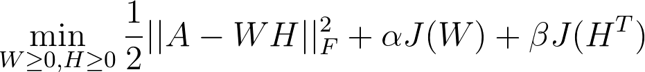

Data Science for Industry Project 1
================
Blake Cuningham CNNBLA001

-   [Introduction](#introduction)
-   [Preparing the data](#preparing-the-data)
    -   [Load required packages](#load-required-packages)
    -   [Get original data into R](#get-original-data-into-r)
    -   [Create separate data frames for orders, customers, items](#create-separate-data-frames-for-orders-customers-items)
    -   [Clean the order items table](#clean-the-order-items-table)
    -   [Add features to customers table](#add-features-to-customers-table)
-   [Building recommender systems](#building-recommender-systems)
    -   [Simple bought products approach (i.e. user-based collaborative filtering)](#simple-bought-products-approach-i.e.-user-based-collaborative-filtering)
    -   [Item-based approach](#item-based-approach)
    -   [Matrix factorization approach](#matrix-factorization-approach)
    -   [User-based recommendations incorporating non-product data](#user-based-recommendations-incorporating-non-product-data)
-   [Combining into an ensemble recommender](#combining-into-an-ensemble-recommender)
-   [Conclusion](#conclusion)

Introduction
============

The goal of this assignment is to produce a recommender system to help recommend products to Getwine.co.za customers. There are several ways to do this, but the approach that will be taken here will exhibit the following characteristics:

-   The recommender will **not** exclude products if the customer has bought the item before. While a goal of the recommender is to help customers discover new wines, the main goal should be to help get them to buy more wine. Reminding customers about wines they may have ordered before (and hopefully liked) should aid this.
-   The final recommender will take an ensemble approach combining four different recommendation methods:
-   Simple recommendation based on purchase profile similarity to other customers.
-   Simple recommendation based on purchased product similarity to other products.
-   Implied rating recommendation based on predicting would-be ratings for all products.
-   Recommendation based on purchase profile similarity to other customers, *and* demographic similarity to other customers.

The document will go through implementing this approach on a step-by-step basis, showing intermediate outputs, and ultimately displaying the final recommendations for two specific customers: 41777, and 411.

Preparing the data
==================

Load required packages
----------------------

``` r
rm(list = ls())

suppressWarnings(suppressMessages(library(data.table)))
suppressWarnings(suppressMessages(library(tidyverse)))
suppressWarnings(suppressMessages(library(lubridate)))
suppressWarnings(suppressMessages(library(stringr)))
```

Get original data into R
------------------------

The `fread` command from the *data.table* package is used because it is significantly faster than `read.csv`.

``` r
orders_orig <- data.frame(fread("data/orders.csv", header = T))
order_items <- data.frame(fread("data/order-items.csv", header = T))
```

Create separate data frames for orders, customers, items
--------------------------------------------------------

In order to make the data more manageable, it is initially split into three tables - this puts it into "normal form" making it easier to work with the correct data structure in isolation. Specifically, a *customers* and an *orders* (without duplicate customer information) table are created.

``` r
# create customers data frame with all static customer data
customers <- orders_orig %>%
  select(customers_id, customers_gender, customers_dob) %>%
  unique() %>%
  mutate(customers_id = as.numeric(customers_id)) %>%
  arrange(customers_id)

# create orders data frame without static customer data
orders <- orders_orig %>%
  select(-c(customers_gender, customers_dob)) %>%
  unique() %>%
  mutate(customers_id = as.numeric(customers_id)) %>%
  arrange(customers_id)
```

Clean the order items table
---------------------------

The products in the *order\_items* table contains some imperfect data. In general, the *quantity* measure is a multiple of 6, but sometimes it isn't - this may or may not be correct. Therefore, where it can be seen that it is incorrect, the figure is changed.

Additionally, all products with a price lower than 0 are removed as these were generally not wine related products, or were special accounting entries not relevant for customers.

``` r
order_items <- order_items %>%
  mutate(products_price = as.numeric(products_price)) %>%
  mutate(products_quantity = as.numeric(products_quantity)) %>%
  filter(products_price > 0) %>%
  mutate(products_quantity = ifelse(str_detect(products_name, "case|CASE|Case") & !str_detect(products_name, "6 bottles"),
                                    products_quantity * 12, products_quantity)) %>%
  mutate(products_quantity = ifelse(str_detect(products_name, "case|CASE|Case") & str_detect(products_name, "6 bottles"),
                                    products_quantity * 6, products_quantity)) %>%
  mutate(products_quantity = ifelse(str_detect(products_name, "12 Assorted"),
                                    products_quantity * 12, products_quantity)) %>%
  mutate(products_quantity = ifelse(str_detect(products_name, "Assorted"),
                                    products_quantity * 12, products_quantity)) %>%
  mutate(products_quantity = ifelse(str_detect(products_name, "Budget White"),
                                    products_quantity * 12, products_quantity)) %>%
  mutate(products_quantity = ifelse(str_detect(products_name, "30 bottles"),
                                    products_quantity * 30, products_quantity)) %>%
  mutate(products_quantity = ifelse(str_detect(products_name, "Voucher"),
                                    products_quantity * 6, products_quantity))
```

Add features to customers table
-------------------------------

Later, a recommender will be built which uses demographic data in order to add to the customer similarity calculation. In order for this to work, demographic data needs to be generated. Specifically, the following categorical data is created:

-   Age group
-   Average bottle price bought
-   Country
-   Payment method
-   Number of times ordered

``` r
# number of orders
customers <- orders %>%
  count(customers_id) %>%
  right_join(customers)
```

    ## Joining, by = "customers_id"

``` r
colnames(customers)[colnames(customers) == "n"] <- "order_count"

# age and age group
customers <- customers %>%
  mutate(customers_dob = parse_date_time(customers_dob, "%Y-%m-%d H:%M:%S")) %>%
  mutate(customer_age =  as.period(interval(customers_dob, ymd("20170824")))) %>%
  mutate(customer_age_group = ifelse(customer_age >= years(60), "old", ifelse(customer_age >= years(35), "mid", "young"))) %>%
  mutate(customer_age_group = as.factor(customer_age_group))

# avg. per bottle
customer_item_prices <- left_join(orders, order_items) %>%
  mutate(total_paid = products_price * products_quantity) %>%
  group_by(customers_id) %>%
  summarise("order_amount" = sum(total_paid), "item_count" = sum(products_quantity)) %>%
  mutate(avg_item = order_amount / item_count)
```

    ## Joining, by = "orders_id"

``` r
customers <- customer_item_prices %>%
  select(customers_id, avg_item) %>%
  right_join(customers)
```

    ## Joining, by = "customers_id"

``` r
customers <- customers %>%
  mutate(customer_price_group = ifelse(avg_item >= 500, "luxury",
                                        ifelse(avg_item >= 150, "premium",
                                               ifelse(avg_item >= 50, "economy",
                                                      "budget")))) %>%
  mutate(customer_price_group = as.factor(customer_price_group))

# Add in country and payment method
customers <- customers %>%
  left_join(orders) %>%
  select(-c(date_purchased, orders_id, order_total)) %>%
  distinct(customers_id, .keep_all = T)
```

    ## Joining, by = "customers_id"

``` r
# Order count class
customers <- customers %>%
  mutate(order_freq = ifelse(order_count >= 3, "frequent",
                             ifelse(order_count >= 2, "twice",
                                    "once"))) %>%
  mutate(order_freq = as.factor(order_freq))
```

Identify top and bottom customers by number of unique products bought, then select an example customer from each list. Customers 41777 and 411 are chosen:

``` r
# justify choosing "41777" for a top customers
order_items %>%
  right_join(orders, by = "orders_id") %>%
  count(customers_id) %>%
  arrange(desc(n)) %>%
  head(5) %>%
  knitr::kable(caption = "5 customers with highest variety of products bought")
```

|  customers\_id|    n|
|--------------:|----:|
|           1022|   16|
|          36892|   16|
|          29302|   13|
|          39263|   13|
|          41777|   12|

``` r
# justify choosings "411" for a bottom customer
order_items %>%
  right_join(orders, by = "orders_id") %>%
  count(customers_id) %>%
  arrange(n) %>%
  head() %>%
  knitr::kable(caption = "5 customers with lowest variety of products bought")
```

|  customers\_id|    n|
|--------------:|----:|
|             65|    1|
|            163|    1|
|            411|    1|
|            506|    1|
|            624|    1|
|            889|    1|

The two selected customers are compared below. They seem different in most categories, and it is expected that their recommendations should be different too.

``` r
temp <- customers %>%
  filter(customers_id == "41777" |
           customers_id == "411") %>%
  select(-customer_age) %>% # doesn't seem possible to transpose if containing lubridate type
  # data.frame() %>%
  t() %>%
  data.frame()

colnames(temp) <- c("Low product variety", "High product variety")
knitr::kable(temp, caption = "Comparison of two example customers")
```

|                        | Low product variety | High product variety |
|------------------------|:--------------------|:---------------------|
| customers\_id          | 411                 | 41777                |
| avg\_item              | 720.0000            | 137.9333             |
| order\_count           | 1                   | 3                    |
| customers\_gender      | f                   |                      |
| customers\_dob         | 1944-05-29          | 1950-12-25           |
| customer\_age\_group   | old                 | old                  |
| customer\_price\_group | luxury              | economy              |
| countries\_name        | Cape Town           | Cape Town            |
| payment\_method        | Bank Deposit/EFT    | Credit Card Payment  |
| order\_freq            | once                | frequent             |

Building recommender systems
============================

Simple bought products approach (i.e. user-based collaborative filtering)
-------------------------------------------------------------------------

The user-based collaborative filtering approach uses the similarity of customer purchase history as the basis of customer similarity. Wines purchased by customers with a similar purchase history end up being recommended.

The first step to calculating customer similarities is getting the customer data into wide matrix form:

``` r
# get matrix of "bought wines" i.e. customer_id as rows and wines as columns
customer_products_bought_tall <- order_items %>%
  select(orders_id, products_name) %>%
  inner_join(orders %>% select(customers_id, orders_id)) %>% # use inner join to avoid customers without purchases?
  select(customers_id, products_name) %>%
  unique() %>%
  mutate(bought = 1)
```

    ## Joining, by = "orders_id"

``` r
customer_products_bought_wide <- customer_products_bought_tall %>%
  complete(customers_id, products_name, fill = list(bought = 0)) %>%
  spread(key = products_name, value = bought)

# convert data to matrix form 
sorted_customers_id <- as.character(unlist(customer_products_bought_wide[,1]))
customer_products_bought_wide <- as.matrix(customer_products_bought_wide[,-1])
row.names(customer_products_bought_wide) <- sorted_customers_id
```

The next step is to check for similarity between every customer pair. The `outer` function is used instead of a nested loop - this makes very little difference in this case, but would scale well on larger data. Once the similarity matrix is created, it is saved in the project *output* folder and then read back in with the next chunk - this is a simple way to ensure large calculations do not need to be repeated when knitting the final version of this document.

``` r
cosine_sim <- function(a,b){crossprod(a,b)/sqrt(crossprod(a)*crossprod(b))}
temp_func <- Vectorize(function(x, y) cosine_sim(customer_products_bought_wide[x,], customer_products_bought_wide[y,]))

customer_similarities1 <- outer(seq_len(nrow(customer_products_bought_wide)),
      seq_len(nrow(customer_products_bought_wide)),
      temp_func)

diag(customer_similarities1) <- 0
row.names(customer_similarities1) <- row.names(customer_products_bought_wide)
colnames(customer_similarities1) <- row.names(customer_products_bought_wide)

saveRDS(customer_similarities1, "output/customer_similarities1.rds")
```

``` r
customer_similarities1 <- readRDS("output/customer_similarities1.rds")
```

Finally, a function that takes a customer, a similarity matrix, and overall customer purchase history, is built to generate the recommendations. The method is to multiply the similarity vector of a customer by overall purchase history in order to weight wine by customer similarity, ending up with a vector of wines and an associated score (wines bought often by similar customers will be recommended higher).

``` r
customer_based_recommendations <- function(customer, customer_similarities, bought_wines){
  
  # turn into character if not already
  customer <- ifelse(is.character(customer),customer,as.character(customer))
  
  # get scores
  customer_scores <- data.frame(product = colnames(bought_wines), 
                            score = as.vector(customer_similarities[customer,] %*% bought_wines), 
                            bought = bought_wines[customer,])
  
  # sort unseen movies by score and remove the 'seen' column
  customer_recom <- customer_scores %>% 
    filter(bought == 0) %>%
    arrange(desc(score)) %>% 
    select(-bought) 
  
  return(customer_recom)
}
```

First, the recommendations for the more frequent customer - 41777:

``` r
knitr::kable(head(customer_based_recommendations("41777", customer_similarities1, customer_products_bought_wide)),
             caption = "User-based collaborative filtering for customer 41777")
```

| product                                       |      score|
|:----------------------------------------------|----------:|
| Le Bonheur Cabernet Sauvignon 2014 unlabelled |  12.154488|
| Nitida Roxia Sauvignon Blanc 2016             |  10.439990|
| Raka Spliced 2014                             |   7.189455|
| Buitenverwachting Buiten Blanc 2016           |   4.809960|
| Le Bonheur Tricorne 2012 unlabelled           |   4.372726|
| Klein Steenberg Bordeaux Red 2013             |   4.286724|

And, comparing to the less frequent customer - 411:

``` r
knitr::kable(head(customer_based_recommendations("411", customer_similarities1, customer_products_bought_wide)),
             caption = "User-based collaborative filtering for customer 411")
```

| product                                                     |      score|
|:------------------------------------------------------------|----------:|
| TOP SELLING July Red Case                                   |  1.2071068|
| Buitenverwachting Buiten Blanc 2016                         |  0.5773503|
| Diemersdal Sauvignon Blanc 2017                             |  0.5773503|
| Paradyskloof Grenache, Mourv<c3><a9>dre & Shiraz 2015       |  0.5000000|
| Samarie Smith se luukse kis: Versnit-wynklub                |  0.5000000|
| 30 bottles Rooiberg Brut Sparkling - as arranged with Johan |  0.0000000|

The recommendations for customer 411 seem inferior to 41777 - there did not seem to be enough customers similar enough to 411. Hence, another approach might be to rather recommend based on item similarity.

Item-based approach
-------------------

The item-based approach is very similar to used-based, except similarities are calculated for products and not customers:

``` r
products_customers_wide <- t(customer_products_bought_wide)
```

``` r
temp_func <- Vectorize(function(x, y) cosine_sim(products_customers_wide[x,], products_customers_wide[y,]))

product_similarities1 <- outer(seq_len(nrow(products_customers_wide)),
      seq_len(nrow(products_customers_wide)),
      temp_func)

diag(product_similarities1) <- 0
row.names(product_similarities1) <- row.names(products_customers_wide)
colnames(product_similarities1) <- row.names(products_customers_wide)

saveRDS(product_similarities1, "output/product_similarities1.rds")
```

``` r
product_similarities1 <- readRDS("output/product_similarities1.rds")
```

Then, instead of multiplying a single similarity vector by purchase history (as we did with the user-based approach), the columns corresponding to wines bought by the customer are extracted from the product similarity matrix, and then aggregated by row. This leaves a vector of all wines and an associated score - it is expected to give a list recommending wines that were bought by other people who have bought the same wine as the customer.

``` r
product_based_recommendations <- function(customer, product_similarities, bought_products){
  
  # turn into character if not already
  customer <- ifelse(is.character(customer),customer,as.character(customer))
  
  # get scores
  customer_bought <- row.names(product_similarities)[bought_products[,customer] == TRUE]
  customer_scores <- tibble(product = row.names(product_similarities), 
                        score = apply(data.frame(product_similarities[,customer_bought]),1,sum),
                        bought = bought_products[,customer])
  # sort unseen movies by score and remove the 'seen' column
  customer_recom <- customer_scores %>% filter(bought == 0) %>% arrange(desc(score)) %>% select(-bought)

  return(customer_recom)
  
}
```

The recommendations for the frequent customer show that there are some similar wines that appeared under user-based recommendations:

``` r
knitr::kable(head(product_based_recommendations("41777", product_similarities1, products_customers_wide)),
             caption = "Item-based recommendation for customer 41777")
```

| product                                       |      score|
|:----------------------------------------------|----------:|
| Le Bonheur Cabernet Sauvignon 2014 unlabelled |  1.0176040|
| Nitida Roxia Sauvignon Blanc 2016             |  0.8834183|
| Klein Steenberg Sauvignon Blanc               |  0.8085673|
| Raka Sauvignon Blanc 2017                     |  0.6614065|
| Fleur du Cap Shiraz, 2015                     |  0.6583790|
| Groote Post The Old Mans Blend White 2017     |  0.6509807|

The recommendations for the infrequent customer are still not very high quality - this will be because they have only ever bought 1 product before, so there is no aggregation happening in the recommender function. However, it is interesting to note that the wines recommended are almost the exact same as the user-based recommendations, but with different ordering.

``` r
knitr::kable(head(product_based_recommendations("411", product_similarities1, products_customers_wide)),
             caption = "Item-based recommendation for customer 411")
```

| product                                                     |      score|
|:------------------------------------------------------------|----------:|
| Samarie Smith se luukse kis: Versnit-wynklub                |  0.1581139|
| TOP SELLING July Red Case                                   |  0.1556998|
| Diemersdal Sauvignon Blanc 2017                             |  0.1118034|
| Paradyskloof Grenache, Mourv<c3><a9>dre & Shiraz 2015       |  0.0912871|
| Buitenverwachting Buiten Blanc 2016                         |  0.0725476|
| 30 bottles Rooiberg Brut Sparkling - as arranged with Johan |  0.0000000|

Matrix factorization approach
-----------------------------

The matrix factorization approach aims to fill in missing data by factorising what we know (in the form of a customer-product ratings matrix) into two other matrices, and then recreating the original data from the factored matrices.

In order to create a matrix of customers and their ratings of products, the first step is to select a "rating" measure. The measure chosen is based on the following assumptions:

-   People will pay higher prices for wines they prefer
-   People will buy more of what they like

Hence, the amount of bottles a customer has bought of a wine is multiplied by the per bottle price. The logarithm of this number is then used as the rating (this reduces the impact of very large orders):

``` r
product_ratings <- order_items %>%
  mutate(log_order_val = log(products_quantity * products_price)) %>% # create ratings proxy
  inner_join(orders) %>%
  select(customers_id, products_name, log_order_val) %>%
  group_by(customers_id, products_name) %>%
  summarise(rating_proxy = mean(log_order_val)) %>%
  ungroup() %>%
  # complete(customers_id, products_name, fill = list(ratings_proxy = NA))
  complete(customers_id, products_name) %>%
  spread(key = products_name, value = rating_proxy)
```

    ## Joining, by = "orders_id"

``` r
products_list <- as.character(unlist(product_ratings[,1]))
product_ratings <- as.matrix(product_ratings[,-1])
row.names(product_ratings) <- products_list
```

The *NNLM* package is used to factorise our ratings matrix. The package's algorithms are far more efficient on large matrices than using the `optim` function approach. While there are several parameters that the `nnmf` function takes, the most important is the rank of factored matrices. More information can be stored in higher ranked matrices, but these may over-fit to the training data. Hence, several ranks are considered, and the rank with the lowest test error identified:

``` r
library(NNLM)

# ranks to consider
ranks <- c(1, 2, 3, 4, 5, 10, 20, 50, 100, 200)
# ranks <- c(1, 2, 3) # for testing
mf_acc <- NULL
mf_test_acc <- NULL

# create train and test data
set.seed(1)
pr_sample_ind <- sample(length(product_ratings), ceiling(0.2*length(product_ratings)))
pr_train <- cbind(product_ratings)
pr_train[pr_sample_ind] <- NA
pr_test <- cbind(product_ratings)
pr_test[-pr_sample_ind] <- NA
```

``` r
# iterate through ranks, and record accuracy of each
for (rank in ranks){
  set.seed(1)

  decomp <- nnlm(A = pr_train,
                 alpha = 3e-3,
                 beta = 3e-3,
                 method = "scd",
                 k = rank,
                 max.iter = 10000
                 )
  mf_observed <- decomp$W %*% decomp$H
  
  # Train accuracy
  mf_train_errors <- (mf_observed - pr_train)^2
  mf_train_accuracy <- sqrt(mean(mf_train_errors[!is.na(pr_train)]))
  
  mf_acc <- append(mf_acc, mf_train_accuracy)
  
  # Test accuracy
  mf_test_errors <- (mf_observed - pr_test)^2
  mf_test_accuracy <- sqrt(mean(mf_test_errors[!is.na(pr_test)]))
  
  mf_test_acc <- append(mf_test_acc, mf_test_accuracy)
  
}

rank_test_results <- data.frame("Rank" = ranks, "Train_acc" = mf_acc, "Test_acc" = mf_test_acc)

saveRDS(rank_test_results, "output/rank_test_results.rds")
```

Before plotting the results, the baseline accuracy is calculated. This is simply replacing all missing values with the mean of the training data ratings. The MSE checked against the test data is just over 1:

``` r
check_matrix <- matrix(rep(mean(pr_train, na.rm = T), length(pr_test)), dim(pr_test)[1], dim(pr_test)[2])
check_errors <- (check_matrix - pr_test)^2
check_accuracy <- sqrt(mean(check_errors[!is.na(pr_test)]))
check_accuracy
```

    ## [1] 1.036206

However, the MSE of the factored matrices on the test data was around 3, and actually worsened with all ranks greater than 1. The training error converged to zero after less than 10 rank.

``` r
rank_test_results <- readRDS("output/rank_test_results.rds")

ggplot(rank_test_results) +
  geom_line(aes(x = Rank, y = Train_acc, color = "Train")) +
  geom_line(aes(x = Rank, y = Test_acc, color = "Test")) +
  geom_vline(aes(xintercept = 1), linetype = 2) +
  # scale_color_manual(values = c("Train", "Test"))
  scale_color_discrete("Accuracy") +
  ylab("Mean squared-error") +
  geom_hline(yintercept = check_accuracy, linetype = 3) +
  annotate("text", label = "Baseline accuracy", x = 50, y = 1.2) +
  theme_light()
```


It therefore does not seem valuable to factor with rank greater than 1, so 1 is chosen as the rank for the recommender. `alpha` and `beta` are equivalent to `lambda` in the approach taken during lectures - they are the regularization parameters for each of the two factored matrices per the below equation:



where *J*(*X*) is the penalty applied to the factor matrices.

Additionally, a suitably large maximum number of iterations is chosen, and the *SCD* (Sequential coordinate descent) method is chosen because it is known to converge quickly:

``` r
set.seed(7)

mf1_decomp <- nnmf(A = product_ratings,
                  alpha = 3e-3,
                  beta = 3e-3,
                  method = "scd",
                  k = 1,
                  max.iter = 10000
                  )

saveRDS(mf1_decomp, "models/mf1_decomp.rds")
```

Checking the recommendation for customer 41777 it is seen that the products are very different to the previous two approaches:

``` r
mf1_decomp <- readRDS("models/mf1_decomp.rds")

# Top choices for our user
mf1_predicted <- mf1_decomp$W %*% mf1_decomp$H
t(mf1_predicted[0,head(order(mf1_predicted["41777",], decreasing = T))])
```

    ##                                     
    ## Everyday Red || 12 Assorted Bin 1   
    ## Budget Red || 12 Assorted           
    ## Luxury Red || Assorted              
    ## Budget Mixed || Assorted White & Red
    ## TOP SELLING May RED Case            
    ## JORDAN Lifestyle Case 12-pack

This odd recommendation makes sense if we look at the components in the product factor (the H matrix):

``` r
# Top wines based on H factor
t(mf1_predicted[0,head(order(mf1_decomp$H, decreasing = T))])
```

    ##                                     
    ## Everyday Red || 12 Assorted Bin 1   
    ## Budget Red || 12 Assorted           
    ## Luxury Red || Assorted              
    ## Budget Mixed || Assorted White & Red
    ## TOP SELLING May RED Case            
    ## JORDAN Lifestyle Case 12-pack

The top wines in the matrix, are the top for customer 41777 - hence what this recommender is really doing is recommending the wines with overall high ratings. This is not completely useless though, and may be a good way to recommend to someone with no previous purchase history.

User-based recommendations incorporating non-product data
---------------------------------------------------------

The final approach uses the same method as the first (user-based) approach, except a few extra "products" are added to the matrix that customer similarity was calculated with. These extra products are just demographic variables for each customer, and they should help to improve the similarity calculations. They are added as dummy variables to the customer vs. product matrix:

``` r
# get matrix of "bought wines" i.e. customer_id as rows and wines as columns
customer_products_bought_tall_2 <- order_items %>%
  select(orders_id, products_name) %>%
  inner_join(orders %>% select(customers_id, orders_id)) %>% # use inner join to avoid customers without purchases?
  select(customers_id, products_name) %>%
  unique() %>%
  mutate(bought = 1)
```

    ## Joining, by = "orders_id"

``` r
# create customer attributes data to add
## customer age group
customer_products_bought_tall_2 <- customers %>%
  select(customers_id, customer_age_group) %>%
  mutate(bought = 1) %>%
  complete(customers_id, customer_age_group, fill = list(bought = 0)) %>%
  rename(products_name = customer_age_group) %>%
  rbind(customer_products_bought_tall_2)

## customer gender
customer_products_bought_tall_2 <- customers %>%
  select(customers_id, customers_gender) %>%
  mutate(bought = 1) %>%
  complete(customers_id, customers_gender, fill = list(bought = 0)) %>%
  rename(products_name = customers_gender) %>%
  rbind(customer_products_bought_tall_2)

## customer price group
customer_products_bought_tall_2 <- customers %>%
  select(customers_id, customer_price_group) %>%
  mutate(bought = 1) %>%
  complete(customers_id, customer_price_group, fill = list(bought = 0)) %>%
  rename(products_name = customer_price_group) %>%
  drop_na() %>%
  rbind(customer_products_bought_tall_2)

## customer countries
customer_products_bought_tall_2 <- customers %>%
  select(customers_id, countries_name) %>%
  mutate(bought = 1) %>%
  complete(customers_id, countries_name, fill = list(bought = 0)) %>%
  rename(products_name = countries_name) %>%
  drop_na() %>%
  filter(products_name != "") %>%
  rbind(customer_products_bought_tall_2)

## customer payment method
customer_products_bought_tall_2 <- customers %>%
  select(customers_id, payment_method) %>%
  mutate(bought = 1) %>%
  complete(customers_id, payment_method, fill = list(bought = 0)) %>%
  rename(products_name = payment_method) %>%
  drop_na() %>%
  filter(products_name != "") %>%
  rbind(customer_products_bought_tall_2)

## order frequency
customer_products_bought_tall_2 <- customers %>%
  select(customers_id, order_freq) %>%
  mutate(bought = 1) %>%
  complete(customers_id, order_freq, fill = list(bought = 0)) %>%
  rename(products_name = order_freq) %>%
  drop_na() %>%
  filter(products_name != "") %>%
  rbind(customer_products_bought_tall_2)

## spread data into matrix shape
customer_products_bought_wide_2 <- customer_products_bought_tall_2 %>%
  complete(customers_id, products_name, fill = list(bought = 0)) %>%
  spread(key = products_name, value = bought)

# convert data to matrix form 
sorted_customers_id <- as.character(unlist(customer_products_bought_wide_2[,1]))
customer_products_bought_wide_2 <- as.matrix(customer_products_bought_wide_2[,-1])
row.names(customer_products_bought_wide_2) <- sorted_customers_id
```

The same approach as before calculating similarities:

``` r
cosine_sim <- function(a,b){crossprod(a,b)/sqrt(crossprod(a)*crossprod(b))}
temp_func_2 <- Vectorize(function(x, y) cosine_sim(customer_products_bought_wide_2[x,], customer_products_bought_wide_2[y,]))

customer_similarities2 <- outer(seq_len(nrow(customer_products_bought_wide_2)),
      seq_len(nrow(customer_products_bought_wide_2)),
      temp_func_2)

diag(customer_similarities2) <- 0
row.names(customer_similarities2) <- row.names(customer_products_bought_wide_2)
colnames(customer_similarities2) <- row.names(customer_products_bought_wide_2)

saveRDS(customer_similarities2, "output/customer_similarities2.rds")
```

Then, when actually producing the recommendations the original recommender function is used, and just the new similarity matrix is passed as an argument:

``` r
customer_similarities2 <- readRDS("output/customer_similarities2.rds")

#ensure that similarity matrix is the same size as original
cs_2_indexedBy1 <- customer_similarities2[row.names(customer_similarities1),colnames(customer_similarities1)]
knitr::kable(head(customer_based_recommendations("41777",
                                    cs_2_indexedBy1,
                                    customer_products_bought_wide)),
             caption = "Recommendations for customer 41777")
```

| product                                       |     score|
|:----------------------------------------------|---------:|
| Le Bonheur Cabernet Sauvignon 2014 unlabelled |  24.34088|
| Raka Spliced 2014                             |  23.34637|
| Personalised Mixed Case                       |  21.72720|
| Nitida Roxia Sauvignon Blanc 2016             |  20.88320|
| Le Bonheur Tricorne 2012 unlabelled           |  10.25289|
| Klein Steenberg Bordeaux Red 2013             |   9.94887|

The recommendations for 41777 seems very similar to before, which is a good sign because it shows that the recommendations are not too volatile for customers who already had a good amount of data.

However, the recommendations for customer 411 change quite significantly, meaning that the additional customer information was helpful:

``` r
knitr::kable(head(customer_based_recommendations("411",
                                    cs_2_indexedBy1,
                                    customer_products_bought_wide)),
             caption = "Recommendations for customer 411")
```

| product                                                |     score|
|:-------------------------------------------------------|---------:|
| Personalised Mixed Case                                |  61.61481|
| Knorhoek Shiraz/Cabernet Franc/Cabernet Sauvignon 2015 |  32.77639|
| Le Bonheur Prima 2013 unlabelled                       |  30.79126|
| Raka Spliced 2014                                      |  26.13059|
| Nitida Roxia Sauvignon Blanc 2016                      |  23.33248|
| Phizante Kraal Sauvignon Blanc 2016                    |  20.47049|

Combining into an ensemble recommender
======================================

Each of the previous four approaches had their merits, so they are combined into a unified recommender. The ensemble recommender finds the combined rankings from the different recommenders, recommending the wine with the lowest combined ranking first:

``` r
ensemble_recommender <- function(customer, context_similarities, no_context_similarities, product_similarities, wide_customer_products_matrix, predicted_ratings){
  
  # Convert to character
  customer <- ifelse(is.character(customer), customer, as.character(customer))
  
  # Context containing similarity
  rank_1 <- customer_based_recommendations(customer,
                                      context_similarities,
                                      wide_customer_products_matrix) %>%
    mutate(p_rank = rank(-score)) %>%
    select(product, p_rank)
  
  # User bought similarity only
  rank_2 <- customer_based_recommendations(customer,
                                      no_context_similarities,
                                      wide_customer_products_matrix) %>%
    mutate(p_rank = rank(-score)) %>%
    select(product, p_rank)
  
  # Item similarity
  rank_3 <- product_based_recommendations(customer,
                                     product_similarities,
                                     t(wide_customer_products_matrix)) %>%
    mutate(p_rank = rank(-score)) %>%
    select(product, p_rank)
  
  # Matrix factorization
  rank_4 <- data.frame(score = predicted_ratings[customer,]) %>%
    rownames_to_column("product") %>%
    mutate(p_rank = rank(-score)) %>%
    select(product, p_rank)
  
  # Combination of methods
  customer_recs <- inner_join(inner_join(inner_join(rank_1, rank_2, by = "product"), rank_3, by = "product"), rank_4, by = "product") %>%
    mutate(overall = p_rank.x + p_rank.y + p_rank.x.x + p_rank.y.y) %>%
    select(product, overall) %>%
    mutate(p_rank = rank(overall)) %>%
    select(product, p_rank) %>%
    arrange(p_rank)
  
  return(customer_recs)
}
```

The recommendations for customer 41777 look fairly similar to before, although it is interesting to see a couple of wines recommended that were not previously in the top 6 - this would be the effect of the ensemble recommender that could see a reasonable high ranked wine in other recommenders end up being very highly recommended when looking at its average ranking.

``` r
knitr::kable(head(suppressWarnings(ensemble_recommender("41777",
                     context_similarities = cs_2_indexedBy1,
                     no_context_similarities = customer_similarities1,
                     product_similarities = product_similarities1,
                     wide_customer_products_matrix = customer_products_bought_wide,
                     predicted_ratings = mf1_predicted))),
             caption = "Recommendations for customer 41777")
```

| product                                       |  p\_rank|
|:----------------------------------------------|--------:|
| Le Bonheur Tricorne 2012 unlabelled           |        1|
| Saronsberg Provenance Shiraz 2015             |        2|
| Le Bonheur Cabernet Sauvignon 2014 unlabelled |        3|
| Haute Cabriere Chardonnay/Pinot Noir 2016     |        4|
| Guardian Peak Cabernet Sauvignon 2016         |        5|
| Flagstone Dragon Tree Cape Blend 2014         |        6|

The recommendations for customer 411 are also similar to before, but some more obviously poor recommendations have been filtered out (e.g. "discount from Johan"). The ensemble approach appears to be quite robust in this situation.

``` r
knitr::kable(head(suppressWarnings(ensemble_recommender("411",
                     context_similarities = cs_2_indexedBy1,
                     no_context_similarities = customer_similarities1,
                     product_similarities = product_similarities1,
                     wide_customer_products_matrix = customer_products_bought_wide,
                     predicted_ratings = mf1_predicted))),
             caption = "Recommendations for customer 411")
```

| product                                               |  p\_rank|
|:------------------------------------------------------|--------:|
| TOP SELLING July Red Case                             |        1|
| Samarie Smith se luukse kis: Versnit-wynklub          |        2|
| Diemersdal Sauvignon Blanc 2017                       |        3|
| Buitenverwachting Buiten Blanc 2016                   |        4|
| Paradyskloof Grenache, Mourv<c3><a9>dre & Shiraz 2015 |        5|
| Personalised Mixed Case                               |        6|

Conclusion
==========

The ensemble approach combines the power of the individual recommender engines, but is still lacking in several areas. Suggestions for further improvements to the recommender:

-   Weight each recommender in the ensemble according to its relevance for a customer (i.e. weight the demographic information approach higher for customers without a purchase history, or little purchase history)
-   Add more features to the customer demographic information
-   Use a better metric as the proxy for rating
-   Create a layered recommendation engine that recommends items in a more structured way, leveraging broader product characteristics:
    -   Recommend red or white
    -   Recommend price range
    -   Recommend varietal
    -   Recommend farm
-   Collect more customer information, and incorporate into recommendation engine:
    -   Actual customer ratings of wines, and not just purchases
    -   Customer wine "wish lists"
-   Choose user "sommeliers" who's rating or purchase history could be weighted higher than other users
